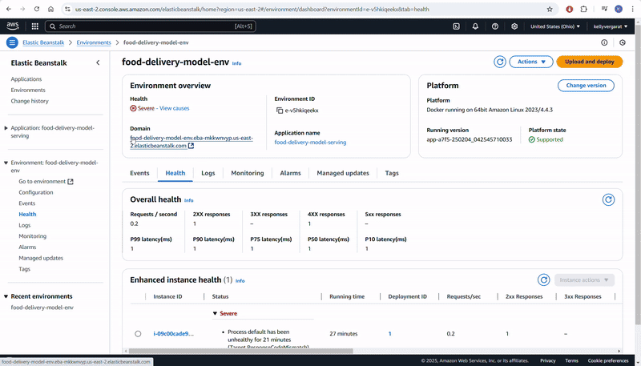

# Food Delivery Time Prediction


### Introduction
This project aims to develop a machine learning model using linear regression to predict food delivery times based on various contextual and operational factors. It serves as the capstone project for the Machine Learning Zoomcamp by DataTalksClub and focuses on optimizing delivery efficiency in the food logistics industry.

### Objective
The primary goal of this project is to build an accurate predictive model that estimates the delivery time for food orders. By analyzing key variables such as distance, weather conditions, traffic levels, and courier experience, this model can assist food delivery platforms in optimizing their operations, improving customer satisfaction, and enhancing decision-making processes.

### Target Audience

This project is designed to be useful for logistics companies, food delivery platforms, and restaurants seeking to improve their delivery operations.

### Value Proposition
By accurately predicting delivery times, businesses can:
* Reduce customer wait times and improve customer satisfaction by 15%.
* Optimize delivery routes, potentially reducing fuel costs by 8%.
* Better manage courier dispatching, leading to 20% more deliveries per shift.
* Provide more accurate ETAs to customers, improving transparency and trust.

### Dataset Description
The dataset used in this project contains structured data points relevant to food delivery logistics. It includes various independent features that influence delivery time, allowing for a robust analysis and model training.

Key Features:
- Order_ID: Unique identifier for each order.
- Distance_km: The delivery distance in kilometers.
- Weather: Weather conditions during the delivery, including Clear, Rainy, Snowy, Foggy, and Windy.
- Traffic_Level: Traffic conditions categorized as Low, Medium, or High.
- Time_of_Day: The time when the delivery took place, categorized as Morning, Afternoon, Evening, or Night.
- Vehicle_Type: Type of vehicle used for delivery, including Bike, Scooter, and Car.
- Preparation_Time_min: The time required to prepare the order, measured in minutes.
- Courier_Experience_yrs: Experience of the courier in years.
- Delivery_Time_min: The total delivery time in minutes (target variable).

### Evaluation Metrics
Model performance was evaluated using Root Mean Squared Error (RMSE) and R-squared. RMSE was chosen as it penalizes larger errors and provides a measure in the same units as the target variable (minutes). R-squared provides insight on the variance explained.

### Repository Structure
The repository is organized as follows:
- **data**: Contains the dataset used for model training and evaluation.
- **models**: Contains the trained model saved as a pickle file.
- **notebooks**: Contains Jupyter notebooks for data exploration, model training, evaluation and test flask served model.
- **scripts**: Contains Python scripts for model training and evaluation.

### Training and running the model locally with Python
To run the model locally, follow these steps:
1. Clone the repository to your local machine.
2. Open command line and go to notebooks directory.
3. Install the required libraries using the following command:
```bash
pip install -r requirements.txt
```
4. Go to scripts directory and run the following command:
```bash
python train.py
```
5. The model will be trained and saved in the models directory.
6. To evaluate the model, run the following command:
```bash
python predict.py
```

### Running the flask served model with Notebook
To run the model using a Jupyter notebook, follow these steps:
1. Inside scripts directory, run the following command:
```bash
python predict.py
```
This will start the Flask server and load the trained model.
2. Open the predict_test notebook in the notebooks directory.
2. Run the cells in the notebook to send a sample request to the Flask server and receive the predicted delivery time.

### Running the model with Docker
To run the model using Docker, follow these steps:
1. Make sure you have Docker installed on your local machine.
2. Open command line and go to the root directory of the project.
3. Build the Docker image using the following command:
```bash
docker build -t food_delivery_model .
```
4. Run the Docker container using the following command:
```bash
docker run --it --rm -p 9696:9696 food_delivery_model
```
5. The Flask server will start inside the Docker container.
6. Open the predict_test notebook in the notebooks directory.
7. Run the cells in the notebook to send a sample request to the Flask server and receive the predicted delivery time.

### Cloud deployment

The app is deployed to AWS EC2 instance. You can use it via the following link:
http://food-delivery-model-env.eba-mkkwnvyp.us-east-2.elasticbeanstalk.com/predict

You can run the elastic bean application locally by following the steps below:
1. Activate the virtual environment
```bash
run pipenv shell
```
2. Run docker container through EB CLI
```bash
eb init -p docker -r us-east-2 food-delivery-model-serving
```
2. Run elastic beanstalk locally
```bash
eb local run --port 9696
```
3. Access the application through url http://localhost:9696/


**Steps to create the elastic beanstalk environment and deploy EB application to AWS**
1. Create the elastic beanstalk application
```bash
eb create food-delivery-model-env
```

**Test the cloud deployed model by running the following command from the main directory**
```bash
python scripts/test.py
```

Video: 




